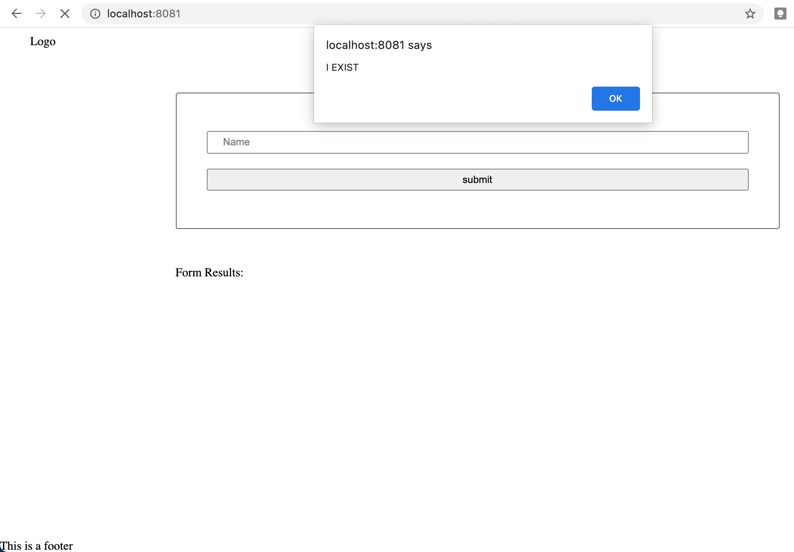
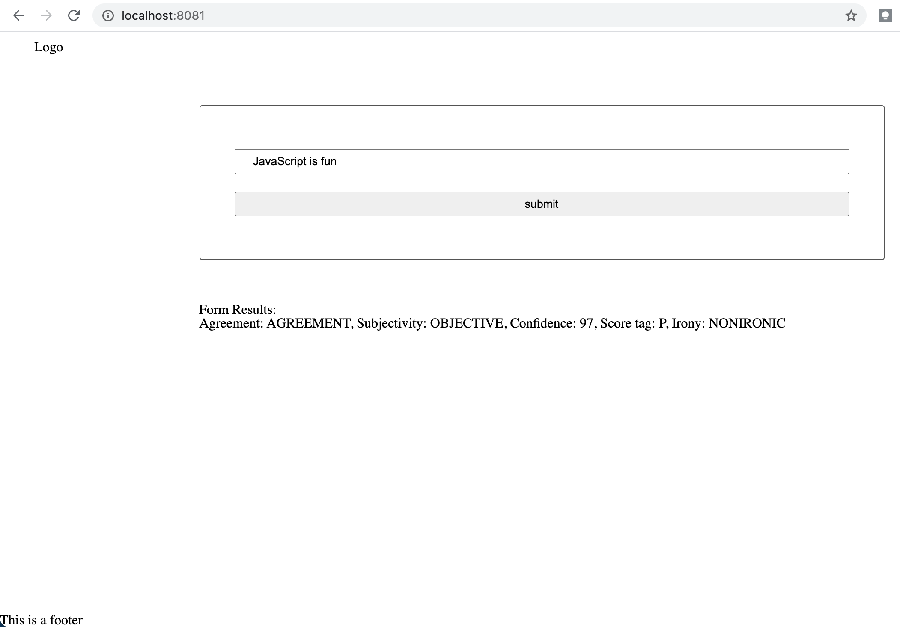

# Client-Server NLP WebApp

This repository creates a little client-server side web application that can send text snipets to the MeaningCloud Sentiment Analysis API and display the results. It's a great starting point if you are interested in learning about
- Setting up Webpack
- Sass styles
- Webpack Loaders and Plugins
- Creating layouts and page design
- Service workers
- Using APIs and creating requests to external urls
- Basic Natural Language Processing

Initial Page             |  Page Response
:-------------------------:|:-------------------------:
  |  

## Installation Instructions
In the terminal run:
- `git clone https://github.com/ImmanuelXIV/evaluate-news-nlp.git`
- `cd evaluate-news-nlp`
- Side note: If you are using Mac OS X you might need to install Xcode or Xcode Command Line Tools (e.g., see [here](https://apps.apple.com/de/app/xcode/id497799835?mt=12))
- Run `npm install` to install all dependencies listed in `package.json`. Among them are e.g., webpack, babel, node-sass, and jest (and some more). Checkout the file if you are interested. If you get an error, try `rm -rf node_modules`, `rm package-lock.json` and install node via brew `brew install node` and try again.

## Get API credentials
- Go to [meaningcloud.com](https://www.meaningcloud.com/developer/sentiment-analysis) and create an account. At the time of writing, the API is free to use up to 1000 requests per day or 333 intensive requests. It is free to check how many requests you have remaining for the day.
- Create a file called `.env` in the root valuate-news-nlp folder and paste this line inside the file `API_KEY=xxxxx<PasteYourKeyHere>xxxxxx`

## Run The App
- Run `npm run build-prod` - should finish without an error.
- Run `npm run start`
- Go to [http://localhost:8081/](http://localhost:8081/) in your browser (e.g. Google Chrome). By default, this app runs on port 8081, but you can edit that in `src/server/index.js`. If everything, goes well, you'll see the app running and a message popping up saying "I EXIST".
- Open another terminal tab ad run `npm run build-dev`. Now, Chrome should open a tab, go to http://localhost:8080/ and respond as before.
- In the [http://localhost:8081/](http://localhost:8081/) tab, provide an input text (only alphanumeric values, else you get a warning) such as "JavaScript is fun", wait a second and see the results displayed in the website.
- Tadaaa - the app is running as intended!

## Testing The App With Jest
If you want to check out the basic Jest unit test in the repository then
- Run `npm run test` in the terminal and look at the test information provided.

## Extend This project
- Deploying the project e.g., on [Netlify](https://www.netlify.com/) or [Heroku](https://www.heroku.com/) should be fun.
- You could display more information received from the MeaningCloud API.
- Brush up the appearance of the web app.
- Be creative

## Acknowledgements
This project of Udacity's Front End Web development Nanodegree. If you are interested, or just want to freshen up your Front End game, I can highly recommend the course!